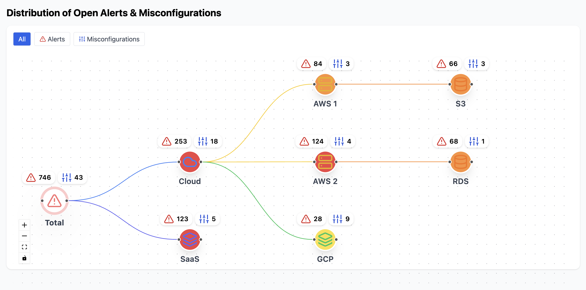

# Interactive Cloud Risk Visualization

A React-based interactive dashboard for visualizing open alerts and misconfigurations across multi-cloud infrastructure (AWS, GCP, SaaS).  
Features a collapsible, filterable, and animated graph for intuitive risk exploration.

---

## 🚀 Features

- **Graph Rendering:** Hierarchical, interactive graph of cloud → accounts → services.
- **Collapsible Nodes:** Click any parent node to collapse/expand its subtree, with smooth animated transitions.
- **Filtering:** Toggle between All, Alerts, and Misconfigurations to focus on specific risks.
- **Alert & Misconfiguration Display:** Each node shows alert and misconfig counts with clear badges.
- **Custom Icons:** Distinct icons for Cloud, AWS, GCP, SaaS, and services.
- **Zoom & Pan:** Fully interactive viewport with mouse and UI controls.
- **Responsive Layout:** Nodes and layout adapt to available space and collapsed state.
- **Tooltip/Side Panel:** Click a node to see details in a compact, auto-hiding tooltip.

---

## 🚀 Live Demo

[Live Demo](https://interactive-cloud-risk-visualizatio.vercel.app/) 


## 🖼️ Screenshot

 

---

## 🛠️ Setup Instructions

1. **Clone the repository:**
   ```bash
   git clone <your-repo-url>
   cd <your-repo-directory>
   ```

2. **Install dependencies:**
   ```bash
   npm install
   ```

3. **Start the development server:**
   ```bash
   npm run dev
   ```

4. **Open your browser:**  
   Visit [http://localhost:5173](http://localhost:5173) (or the port shown in your terminal).

---

## 🧠 Collapsibility & Filtering Logic

### Collapsible Nodes
- Each node with children is clickable.
- Clicking a node toggles its collapsed state, hiding or showing all its descendants and their edges.
- The graph layout and node sizes dynamically adjust to fill available space when nodes are collapsed or expanded.
- Smooth CSS transitions animate the collapse/expand action.

### Filtering
- Use the filter bar at the top to select:
  - **All:** Show all nodes and both alert/misconfig badges.
  - **Alerts:** Show only nodes with alerts, and only the alert badge.
  - **Misconfigurations:** Show only nodes with misconfigs, and only the misconfig badge.
- Filtering is instant and works in combination with collapsibility.

---

## 📦 Project Structure

```
cloud-risk-visualization/
  ├── src/
  │   ├── components/
  │   │   └── Graph.tsx      # Main graph visualization component
  │   ├── data/
  │   │   └── graphData.ts   # Sample data (nodes & edges)
  │   ├── App.jsx
  │   └── main.jsx
  ├── public/
  ├── package.json
  └── README.md
```

---

## 📝 Technical Notes

- **Graph Library:** [React Flow](https://reactflow.dev/) for flexible, interactive graph rendering.
- **Layout:** [Dagre](https://github.com/dagrejs/dagre) for hierarchical node positioning.
- **Icons:** [Lucide](https://lucide.dev/) for modern, consistent node and badge icons.
- **Styling:** Tailwind CSS utility classes for rapid, responsive UI development.
- **Data Modeling:** Nodes and edges are modeled as flat arrays, with parent-child relationships defined by `children` arrays and edge objects.
- **Collapsibility:** State is managed via a `collapsedMap` that tracks which nodes are collapsed, and visible nodes/edges are computed accordingly.

---

## 🧪 Testing & Usage

- **Collapse/Expand:** Click any node with children to collapse/expand its subtree.
- **Filter:** Use the filter bar to focus on alerts or misconfigurations.
- **Zoom & Pan:** Use mouse wheel, drag, or UI controls to navigate the graph.
- **Tooltip:** Click any node to view details; tooltip auto-hides after 5 seconds.

---

## 💡 Further Improvements

- Add keyboard accessibility for node navigation and collapse/expand.
- Integrate real-time data or API sources.
- Add export/print functionality for reports.

---

**Questions or feedback?**  
Open an issue or contact the maintainer.
